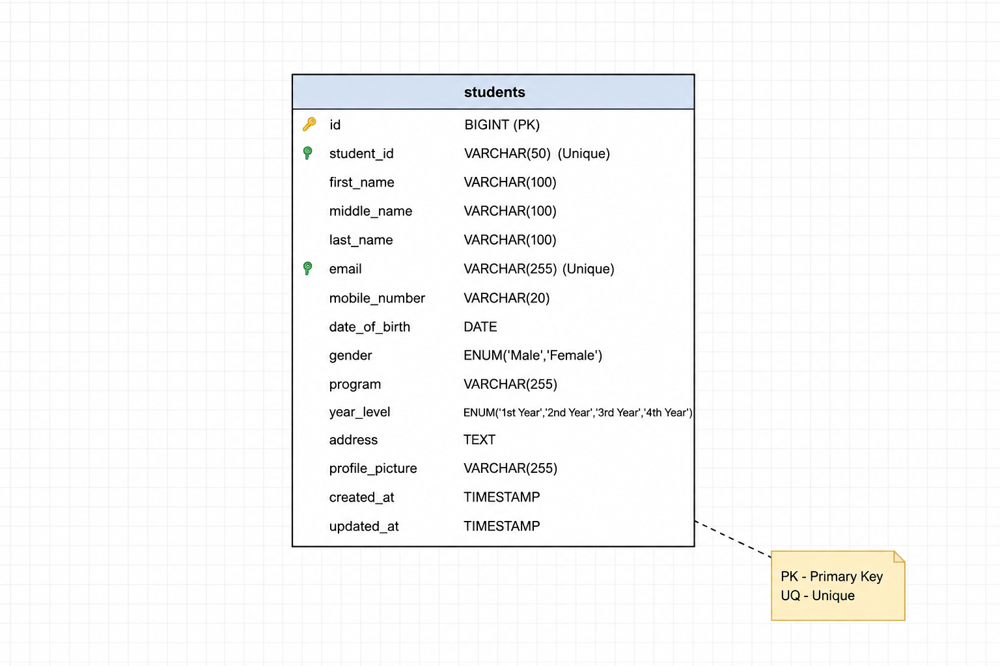
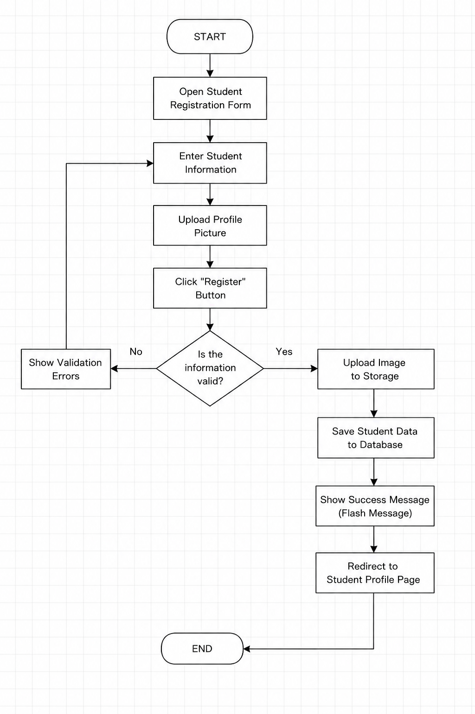
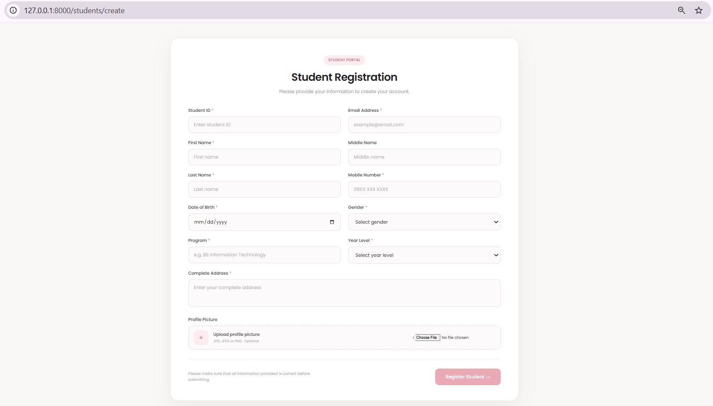
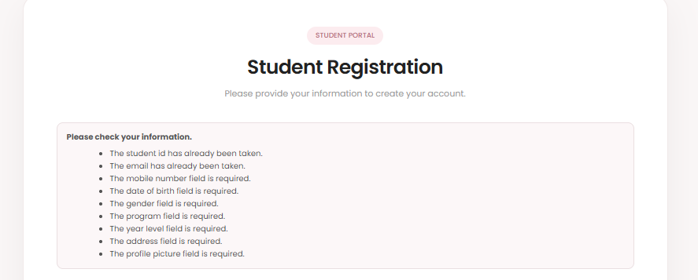
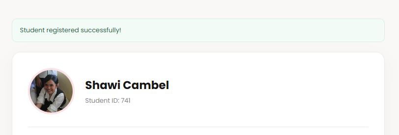
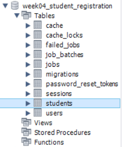
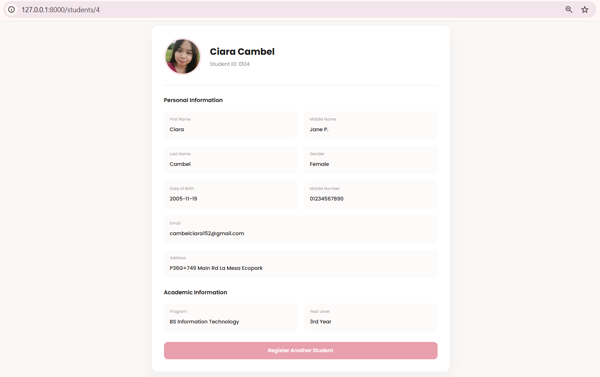
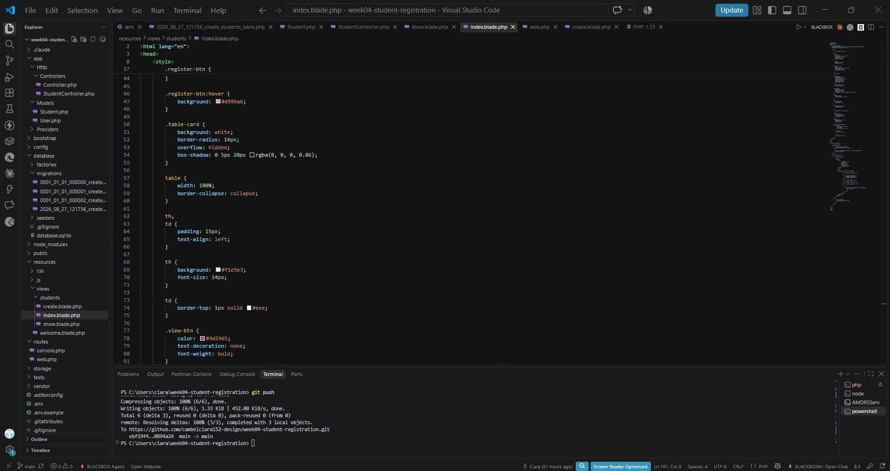

#  1. Week 4 Mini Project 03: Student Registration System

## 2. Introduction
This project is a simple Student Registration System made using Laravel. It allows a user to enter student information and register it into the system.

The system has a registration form where the user can enter the student's ID, name, email, mobile number, date of birth, gender, program, year level, address, and profile picture.

The information is checked before it is saved. If there are errors, the system will show the errors on the form. If everything is correct, the student information will be saved in the MySQL database and the uploaded profile picture will be stored using Laravel Storage.

This project was created for the Week 4 laboratory activity of ITST 302 – Client-Server Technologies.

---

## 3. Objectives

The main objectives of this project are:

* To learn how to create a Laravel project.
* To create a student registration form using Blade.
* To use Laravel routes and controllers.
* To learn how Laravel validation works.
* To save data in a MySQL database.
* To upload and store an image using Laravel Storage.
* To display success messages and validation errors.
* To understand the basic Laravel request process.
* To use Git and GitHub for the project.

---

## 4. Laravel Request Lifecycle
The basic process of the Student Registration System is:
**Browser → Route → Controller → Validation → Model → Database → Response**

### 1. Browser
The user opens the student registration page and fills out the form.

### 2. Route
Laravel receives the request and checks the route in `routes/web.php`.

### 3. Controller
The `StudentController` handles the request.

### 4. Validation
The information is checked to make sure that the required fields are complete and the values are valid.

### 5. Model
The `Student` model is used to work with the student data.

### 6. Database
The student information is saved in the `students` table in MySQL.

### 7. Response
Laravel returns a response to the user. It can show validation errors or a successful registration message.

---

## Validation Rules

The system checks the information before saving it.

Some of the validation rules are:

| Field                | Validation                       |
| -------------------- | -------------------------------- |
| Student ID           | Required and unique              |
| First Name           | Required                         |
| Middle Name          | Optional                         |
| Last Name            | Required                         |
| Email                | Required, valid email and unique |
| Mobile Number        | Required and numeric             |
| Date of Birth        | Required                         |
| Gender               | Required                         |
| Program              | Required                         |
| Year Level           | Required                         |
| Address              | Required                         |
| Profile Picture      | Required image                   |
| Profile Picture Type | JPG, JPEG, PNG                   |
| Profile Picture Size | Maximum 2 MB                     |

If the information is not correct, Laravel returns the user to the form and displays the errors.

---

## 6. Database Design
The system uses a MySQL database named:
`week04_student_registration`
The main table used by the project is:
`students`

### Students Table

| Column          | Description                 |
| --------------- | --------------------------- |
| id              | Primary key                 |
| student_id      | Student ID                  |
| first_name      | Student first name          |
| middle_name     | Student middle name         |
| last_name       | Student last name           |
| email           | Student email               |
| mobile_number   | Student mobile number       |
| gender          | Student gender              |
| date_of_birth   | Student date of birth       |
| program         | Student program             |
| year_level      | Student year level          |
| address         | Student address             |
| profile_picture | Path of uploaded picture    |
| created_at      | Date the record was created |
| updated_at      | Date the record was updated |

The `student_id` and `email` fields are unique.

The profile picture is not saved directly in the database. Only its file path is saved.

### ER Diagram

---

## 7. Flowchart

---

## 8. Screenshots

---

## 9. Problems Encountered 
None

## 10.  Solution
None

---

## 11. Reflection

This project helped me understand Laravel better because I was able to create a small system from the beginning. Before doing this activity, I knew some basic programming concepts, but I was not very familiar with how Laravel connects the different parts of a web application.

One of the things I learned is how routes work. The route tells Laravel where a request should go. I also learned about controllers and how they handle the actions of the system. The `StudentController` is responsible for handling the registration process and showing the student information.

I also learned how to create a migration. The migration allowed me to create the students table in MySQL using Laravel. I learned that the migration is important because it defines the columns that will be stored in the database. I also learned how the Student model is connected to the students table.

Another part that I learned is validation. It is important because users can enter wrong or incomplete information. Laravel can check the submitted data before saving it. I learned how to check required fields, unique values, email format, and uploaded files.

The profile picture upload was also something new for me. I learned that the actual image does not need to be stored inside the database. Instead, Laravel stores the file and the database keeps the path of the image.

I also experienced some problems while making the project. There were times when I needed to check the terminal and make sure that the commands were being run in the correct folder. I also needed to understand how the database, migration, model, controller, routes, and Blade pages work together.

Overall, this activity helped me understand the basic Laravel workflow better. I learned that building a system is not only about writing code. Each part has its own purpose, and they need to work together. This project also gave me more confidence in using Laravel, MySQL, and GitHub for future projects.

---

## 12. References

Laravel. (n.d.). *Laravel documentation*. https://laravel.com/docs

Laravel. (n.d.). *File storage*. https://laravel.com/docs/filesystem

Laravel. (n.d.). *Validation*. https://laravel.com/docs/validation

MySQL. (n.d.). *MySQL documentation*. https://dev.mysql.com/doc/
